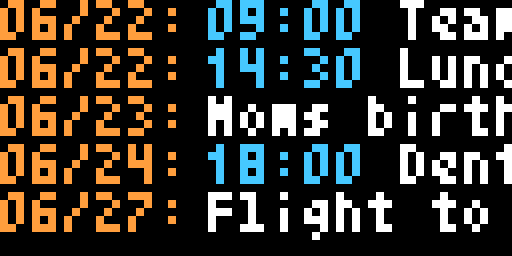

<div align="center">

# 📅 Tidbyt Calendar

**The next 5 events from your Google Calendar, scrolling on your Tidbyt.**




<sub><i>Illustrative demo with sample events.</i></sub>

</div>

---

A small self-hosted service that puts your upcoming calendar on a [Tidbyt](https://tidbyt.com).
It reads a Google calendar, renders a 64×32 tile, and pushes it to your device every
15 minutes — each row is `MM/DD:` (amber) `HH:MM` (cyan) and the event title (white),
scrolling when it doesn't fit. All-day events simply omit the time.

It runs entirely on your own machine (Python + [Pixlet](https://github.com/tidbyt/pixlet)),
so it keeps working independently of Tidbyt's cloud.

## Features

- 🗓️ **Next 5 events** from any Google calendar, including in-progress and all-day.
- 🎨 **Color-coded & legible** on the tiny display — amber dates, cyan times, white titles.
- 📜 **Auto-scrolling** titles that don't fit, looping per row.
- 🔄 **Refreshes every 15 min** and pushes automatically.
- 🔒 **Private** — your OAuth token and config never leave your machine; nothing is committed.
- 🧩 **Graceful** — shows `No Events` / `Calendar unavailable` instead of breaking.

## How it works

```
Google Calendar API  ──►  Python service  ──►  pixlet render (app.star)  ──►  Tidbyt push API
   (user OAuth)            fetch + schedule        64×32 .webp tile             your device
```

See [`SPEC.md`](./SPEC.md) for behavior and [`DEV_PLAN.md`](./DEV_PLAN.md) for the design.

## Requirements

- [`uv`](https://docs.astral.sh/uv/) and [`pixlet`](https://github.com/tidbyt/pixlet) v0.34+ on your PATH.
- A Tidbyt device — its `TIDBYT_DEVICE_ID` and `TIDBYT_API_TOKEN` available as
  environment variables (e.g. sourced from `~/.zsh_secrets`).
- A Google account that owns the calendar you want to show.

## Quickstart

```bash
uv sync                                # create .venv + install
cp config.example.yaml config.yaml     # then edit calendar_id + timezone
```

Do the [one-time Google setup](#one-time-google-setup) to create credentials, then run:

```bash
# sources TIDBYT_* secrets, then starts the scheduler + preview server
zsh -c 'source ~/.zsh_secrets && uv run tidbyt-calendar'
```

The first push happens immediately, then every 15 minutes.

## Configuration

Non-secret settings live in `config.yaml` (gitignored). Any field can be overridden
by an environment variable of the same `UPPER_CASE` name.

| Field                      | Description                                              | Default                |
| -------------------------- | -------------------------------------------------------- | ---------------------- |
| `calendar_id`              | Google Calendar ID to display (an email, or `…@group…`)  | — (required)           |
| `timezone`                 | IANA timezone for dates/times                            | host local             |
| `refresh_interval_minutes` | How often to refetch and push                            | `15`                   |
| `installation_id`          | Tidbyt installation slot                                 | `calendar`             |
| `credentials_file`         | OAuth client JSON (kept outside the repo)                | `~/.tidbyt/calendar/credentials.json` |
| `token_file`               | Saved OAuth token                                        | `~/.tidbyt/calendar/token.pickle`     |

Secrets (`TIDBYT_DEVICE_ID`, `TIDBYT_API_TOKEN`) come from the **environment only** —
never put them in `config.yaml`.

## One-time Google setup

You need OAuth **user** credentials for the account that owns the calendar. Only the
consent step needs a browser; afterward the token refreshes silently.

1. **Calendar ID.** In Google Calendar → **Settings** → your calendar →
   **Integrate calendar** → copy the **Calendar ID** into `config.yaml`. (A primary
   calendar's ID is just the account's email.)

2. **Enable the API.** At [console.cloud.google.com](https://console.cloud.google.com),
   signed in as that account: create a project → **APIs & Services → Library** →
   enable **Google Calendar API**.

3. **OAuth consent screen.** **APIs & Services → OAuth consent screen** → User type
   **External** → add scope `https://www.googleapis.com/auth/calendar.readonly` →
   add the account as a **Test user**.

   **Then click "Publish app" → "In production".** Refresh tokens from an app in
   *Testing* expire after **7 days**; publishing removes that cap. No Google
   verification is needed for personal use — you'll just click through an
   "unverified app" notice at consent (**Advanced → Go to … (unsafe)**).

4. **Create the client.** **Credentials → Create credentials → OAuth client ID →
   Desktop app** → **Download JSON** → save it where `config.yaml` expects:

   ```bash
   mkdir -p ~/.tidbyt/calendar
   mv ~/Downloads/client_secret_*.json ~/.tidbyt/calendar/credentials.json
   ```

5. **Authorize (headless-friendly, no tunnel).** Two commands:

   ```bash
   uv run tidbyt-calendar-authorize            # prints a consent URL
   ```

   Open the URL on **any** browser, sign in, approve. The browser then tries to
   load `http://localhost:8765/?…code=…` and shows "site can't be reached" — that's
   expected. Copy the **full address-bar URL** and exchange it:

   ```bash
   uv run tidbyt-calendar-authorize "<pasted-url>"   # writes token.pickle
   ```

`credentials.json` and `token.pickle` are secrets — kept outside the repo and never
committed.

## Run as a service

**systemd** (auto-refresh, restart on failure):

```bash
sudo cp deploy/tidbyt-calendar.service /etc/systemd/system/
sudo systemctl daemon-reload && sudo systemctl enable --now tidbyt-calendar
journalctl -u tidbyt-calendar -f
```

**Docker:** `docker build -t tidbyt-calendar .`, then run with `config.yaml`, the
OAuth dir, and `TIDBYT_*` mounted/passed (see the comment in the [`Dockerfile`](./Dockerfile)).

## Control endpoints

While running, the service serves on `127.0.0.1:8080`:

- `GET /tidbyt_preview.webp` — render the current tile **without** pushing.
- `POST /push` — force a render + push now.
- `GET /healthz` — liveness check.

## Development

```bash
uv run pytest                       # parsing, config, payload + pixlet render smoke tests
uv run ruff check src tests         # lint

# render the tile by hand (no Google needed) and preview it:
pixlet render src/tidbyt_calendar/tidbyt/app.star \
  'data={"events":[{"date":"06/22","time":"17:00","title":"Mom birthday"}],"message":null}' -o /tmp/t.webp
```

The tile layout lives in [`src/tidbyt_calendar/tidbyt/app.star`](./src/tidbyt_calendar/tidbyt/app.star);
the colors are constants at the top of that file.
